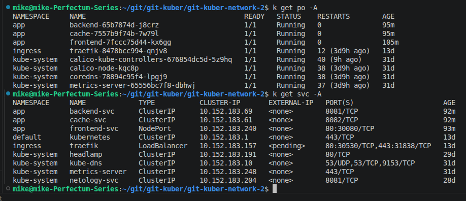
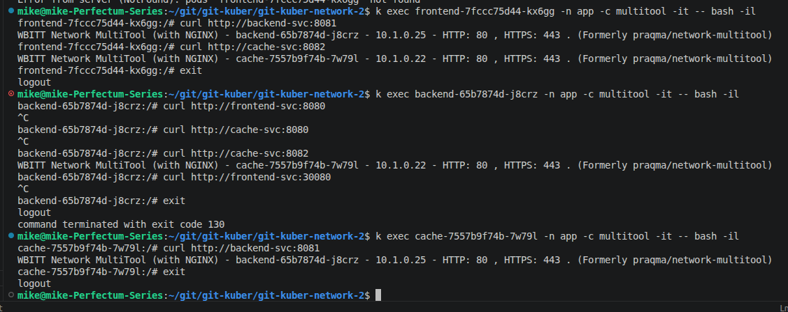
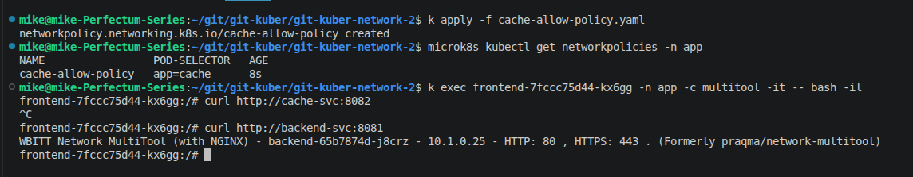
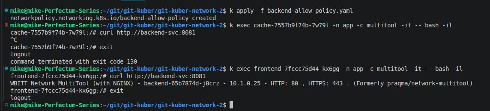

# Домашнее задание к занятию "`Как работает сеть в K8s`" - `Белов Михаил`

### Цель задания

Настроить сетевую политику доступа к подам.

### Чеклист готовности к домашнему заданию

1. Кластер K8s с установленным сетевым плагином Calico.

### Инструменты и дополнительные материалы, которые пригодятся для выполнения задания

1. [Документация Calico](https://www.tigera.io/project-calico/).
2. [Network Policy](https://kubernetes.io/docs/concepts/services-networking/network-policies/).
3. [About Network Policy](https://docs.projectcalico.org/about/about-network-policy).

-----

### Задание 1. Создать сетевую политику или несколько политик для обеспечения доступа

1. Создать deployment'ы приложений [frontend](frontend-deploy.yaml), [backend](backend-deploy.yaml) и [cache](cache-deploy.yaml) и соответсвующие сервисы.
- Сервисы:

**Frontend** - **NodePort**, чтобы сделать фронтенд доступным для внешних пользователей из браузера или через curl с хостовой машины.

**Backend и Cache** - **ClusterIP**, чтобы сделать эти сервисы доступными только внутри кластера (для внутреннего взаимодействия подов).

2. В качестве образа использовать network-multitool.
3. Разместить поды в namespace app.
- Создать namespace app:
```
kubectl create namespace app
```
- Запустить deployments и services:
```
k apply -f frontend-deploy.yaml
k apply -f backend-deploy.yaml
k apply -f cache-deploy.yaml
k apply -f frontend-svc.yaml
k apply -f backend-svc.yaml
k apply -f cache-svc.yaml
```
- Просмотр запущенных подов и сервисов:
```
k get po -A
k get svc -A
```


- Проверка доступности подов между собой (кроме frontend) внутри ноды:
```
# Зайти в контейнер пода:
k exec  <имя_пода> -n app -c multitool -it -- bash -il

# Проверить доступность соседнего пода (например, backend):
curl http://backend-svc:8081
```


- Под frontend имеет сервис с типом NodePort, поэтому доступен извне, но не из соседних подов

4. Создать политики, чтобы обеспечить доступ frontend -> backend -> cache. Другие виды подключений должны быть запрещены.
- Сетевые политики работают по принципу "Все, что не разрешено, то запрещено"

- [Манифест политики разрешающей доступ к поду cache только из пода backend](cache-allow-policy.yaml)

5. Продемонстрировать, что трафик разрешён и запрещён.

- Попытка получить доступ к поду cache из frontend:



- Доступ к backend из frontend и отсутствие доступа к backend из cache:

